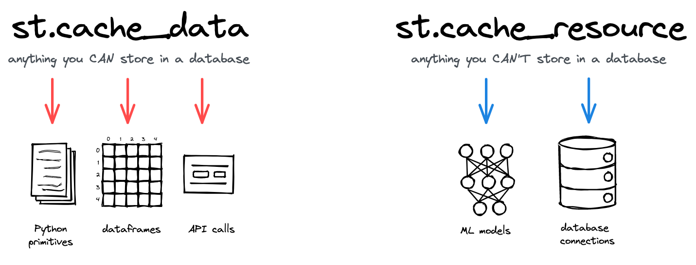

## Notes

- @st.cache_data decorator to cache heavy computation data
- @st.cache_data is the recommended way to cache computations that return data

- @st.session_state with key or attribute notation to store and recall values. For example, st.session_state["my_key"] or st.session_state.my_key
- 